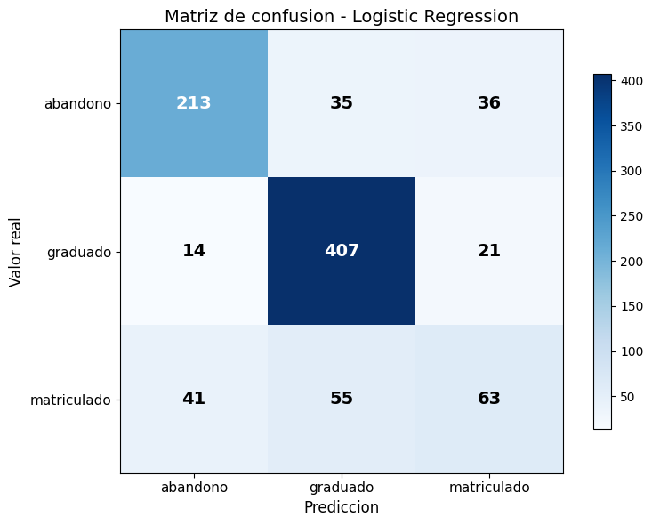
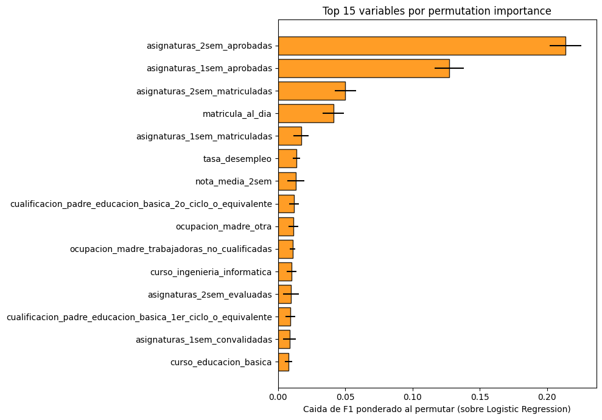
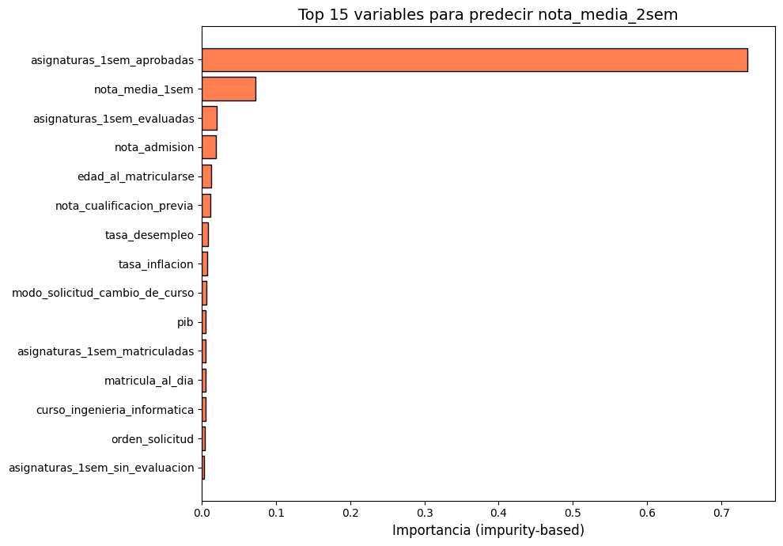
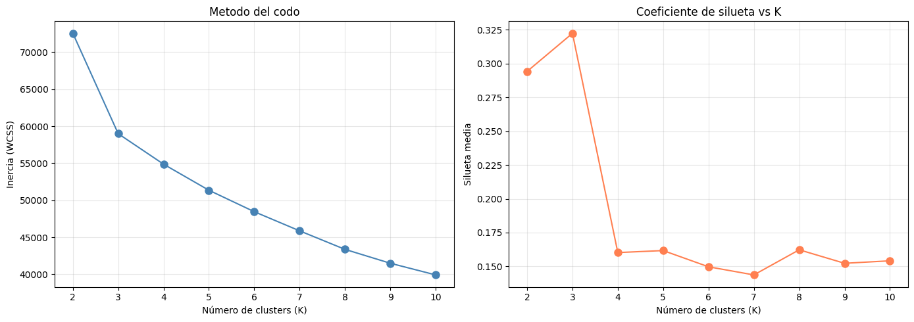
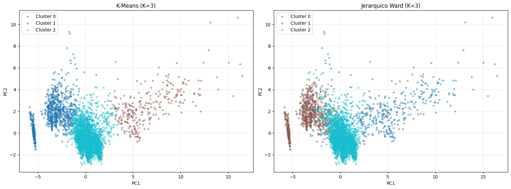

# Student Success Prediction in Higher Education

[](https://github.com/rodrigosicilia/student-success-ml/actions/workflows/validate-notebook.yml)

Machine-learning analysis of student dropout, continued enrolment and graduation in higher education. The project combines supervised classification, grade regression and unsupervised student profiling in a single reproducible notebook.

Developed by **Rodrigo Alejandro Sicilia Maroto** as the final project for the Machine Learning course (2025/2026), Universidad Pontificia Comillas - ICAI.

## A note on language

**The notebook is written in Spanish.** Section headings, code comments, printed output and the dataset's own column names are all in Spanish, and that is deliberate: it was submitted as coursework in Spanish, so translating it would misrepresent what was handed in. This README is the English entry point.

You do not need Spanish to follow the analysis. The tables below cover the labels that show up most often when you run the notebook.

### Section headings

| Spanish | English |
| --- | --- |
| Importaciones y carga de datos | Imports and data loading |
| Analisis exploratorio de datos (EDA) | Exploratory data analysis |
| Preprocesado | Preprocessing |
| Tarea 1: Clasificacion | Task 1: Classification |
| Tarea 2: Regresion | Task 2: Regression |
| Tarea 3: Aprendizaje no supervisado | Task 3: Unsupervised learning |
| Interpretacion y conclusiones | Interpretation and conclusions |

### Target classes

| Spanish | English |
| --- | --- |
| `objetivo` | target variable |
| `abandono` | dropped out |
| `matriculado` | still enrolled |
| `graduado` | graduated |

### Variables that dominate the output

| Spanish | English |
| --- | --- |
| `nota_media_1sem` / `nota_media_2sem` | first / second semester mean grade |
| `asignaturas_1sem_matriculadas` | subjects enrolled in, first semester |
| `asignaturas_1sem_aprobadas` | subjects passed, first semester |
| `asignaturas_1sem_evaluadas` | subjects assessed, first semester |
| `asignaturas_1sem_convalidadas` | subjects credited from prior study |
| `asignaturas_1sem_sin_evaluacion` | subjects with no assessment |
| `nota_admision` | admission grade |
| `nota_cualificacion_previa` | previous qualification grade |
| `edad_al_matricularse` | age at enrolment |
| `matricula_al_dia` | tuition fees up to date |
| `becado` | scholarship holder |
| `deudor` | in debt to the university |
| `desplazado` | studying away from home |
| `genero` | gender (`hombre` male, `mujer` female) |
| `internacional` | international student |
| `si` / `no` | yes / no |

### Recurring output labels

| Spanish | English |
| --- | --- |
| Mejor modelo | Best model |
| Mejores parametros | Best hyperparameters |
| Comparacion de modelos optimizados | Comparison of tuned models |
| Evaluacion en el conjunto de TEST | Held-out test set evaluation |
| Matriz de confusion | Confusion matrix |
| Curva de aprendizaje | Learning curve |
| Importancia de variables | Feature importance |
| Intervalos de confianza bootstrap | Bootstrap confidence intervals |
| Silueta | Silhouette score |
| Tasa de abandono | Dropout rate |
| Varianza explicada | Explained variance |

The dataset uses Spanish column names and category labels as well; `data/README.md` documents where it comes from.

## Project highlights

- **Multiclass classification:** six linear and non-linear models compared with stratified cross-validation. Logistic Regression achieved a weighted F1-score of **0.7617** and test accuracy of **0.7718**.
- **Second-semester grade regression:** leakage-prone second-semester predictors were excluded. Lasso achieved **R2 = 0.7430**, **RMSE = 2.6379** and **MAE = 1.5521**.
- **Unsupervised learning:** PCA, K-Means and Ward hierarchical clustering identified three stable student profiles. K-Means achieved a silhouette score of **0.3223**, with a mean subsampling ARI of **0.9922**.
- **Interpretability and robustness:** permutation importance, impurity-based importance, residual analysis, learning curves and bootstrap confidence intervals.
- **Early-warning analysis:** using only information available before the first semester reduced weighted F1 from **0.7617** to **0.6270**, showing the value of early university performance data.

## Main results

### Classification

The strongest classes were `graduado` and `abandono`; `matriculado` was substantially harder because it is both the smallest class and an intermediate state that overlaps with the other two outcomes.



Academic performance variables from the first and second semesters dominated the permutation-importance ranking, followed by administrative variables such as tuition status.



### Regression

The most informative predictors of second-semester mean grade were the number of first-semester subjects passed and the first-semester mean grade. A reduced set of 21 numerical and binary predictors lost only 0.007 R2 compared with the full encoded feature set.



### Student profiles

The elbow criterion and the silhouette score both pointed to three clusters.



Both K-Means and Ward clustering recovered a similar three-group structure: a low-performance group with a high concentration of dropouts, a large standard-student group and a smaller high-workload group with many credited subjects.



## Repository structure

```text
student-success-ml/
├── README.md
├── LICENSE
├── requirements.txt
├── .python-version
├── .gitignore
├── .gitattributes
├── .github/
│   ├── workflows/
│   │   └── validate-notebook.yml
│   └── scripts/
│       └── check_results.py
├── notebooks/
│   └── student_success_analysis.ipynb
├── data/
│   ├── README.md
│   └── rendimiento_estudiantes.csv
└── assets/
    ├── classification_confusion_matrix.png
    ├── classification_permutation_importance.png
    ├── regression_feature_importance.png
    ├── clustering_model_selection.png
    └── pca_cluster_comparison.png
```

## Reproducibility

The notebook was developed on Python 3.13. The GitHub Actions workflow executes it end to end on Python 3.11, 3.12 and 3.13 on every push and pull request, then checks that the headline results are still there. A full run takes roughly six to ten minutes.

Everything is driven by one seed, `RANDOM_STATE = 42`, set in the first code cell.

### Windows PowerShell

```powershell
git clone https://github.com/rodrigosicilia/student-success-ml.git
cd student-success-ml
py -3.13 -m venv .venv
.\.venv\Scripts\Activate.ps1
python -m pip install --upgrade pip
python -m pip install -r requirements.txt
jupyter lab
```

### macOS or Linux

```bash
git clone https://github.com/rodrigosicilia/student-success-ml.git
cd student-success-ml
python3.13 -m venv .venv
source .venv/bin/activate
python -m pip install --upgrade pip
python -m pip install -r requirements.txt
jupyter lab
```

Open `notebooks/student_success_analysis.ipynb` and run **Kernel -> Restart Kernel and Run All Cells**. The notebook looks for the dataset both from the repository root and from `notebooks/`, so either working directory is fine.

A headless run does the same thing without opening JupyterLab:

```bash
jupyter nbconvert --to notebook --execute notebooks/student_success_analysis.ipynb \
  --output student_success_analysis_executed.ipynb \
  --output-dir executed \
  --ExecutePreprocessor.timeout=1800
```

### Dependency bounds

`requirements.txt` uses lower bounds instead of exact pins, so the project installs on more than one Python version. There are two upper bounds, and each is there because a newer release genuinely breaks this notebook:

- `matplotlib < 3.11` - matplotlib 3.11 removed the `labels` argument of `Axes.boxplot()`, which the grouped box plots in section 2.7 use.
- `pandas < 4` - pandas 4 will stop returning text columns from `select_dtypes(include=['object'])`, which the one-hot encoding in section 3 relies on.

## Methodology

1. **Exploratory data analysis:** class balance, distributions, consistency checks, correlations and interaction profiles.
2. **Preprocessing:** rare-category grouping, one-hot encoding, stratified train/test splitting and training-only standardisation.
3. **Classification:** Logistic Regression, LDA, KNN, Random Forest, Gradient Boosting and RBF SVM.
4. **Regression:** Linear Regression, Ridge, Lasso, Elastic Net, Random Forest and KNN.
5. **Unsupervised learning:** StandardScaler, PCA, K-Means, Ward clustering and stability analysis.
6. **Validation:** five-fold cross-validation, held-out test evaluation, learning curves and bootstrap confidence intervals.

Category grouping, one-hot encoding and scaling are fitted on the training split only, and the cross-validation loops refit the scaler inside each fold, so no test information reaches the models.

## Dataset

The project uses a Spanish-labelled derivative of the UCI **Predict Students' Dropout and Academic Success** dataset: 4,424 anonymised records, 36 predictors and one three-class target. See [`data/README.md`](data/README.md) for attribution and licensing details.

## Limitations and responsible use

- The `matriculado` class is an intermediate state and is inherently harder to distinguish from eventual graduation or dropout.
- The second-semester mean grade is structurally bimodal: many observations are zero, while passing averages lie mostly between 10 and 20.
- Administrative and socioeconomic variables can reflect underlying structural factors; associations must not be interpreted as causal effects.
- Any real institutional deployment would require fairness analysis, calibration, monitoring and human oversight. The models in this repository are an academic study, not a production decision system.

## License

The source code and notebook are released under the [MIT License](LICENSE). The dataset is governed separately by the CC BY 4.0 terms described in [`data/README.md`](data/README.md).
